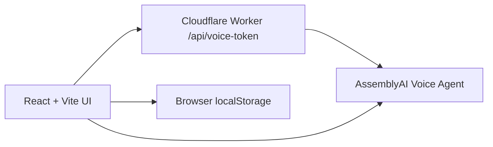

# GroomNote AI

**Less typing. More tail wags.** A hackathon MVP for small pet grooming salons. Groomers talk through a completed fictional appointment, review a structured draft, edit it, and explicitly approve the note before saving.

## Try it locally

```bash
npm ci
npm run dev
```

Open the local URL shown by Vite, then select **Live demo → Use text walkthrough**. Choose Bella, Milo, or Luna; enter appointment details; end the conversation; edit the record; approve and save. Reload and use **Open saved record**. The text walkthrough uses scripted prompts and conservative keyword rules. It is a functional UI preview, **not an AI voice demonstration**.

`npm run build` compiles the React application and Cloudflare Worker. `npm run lint` runs oxlint.

## Online preview

The repository includes a GitHub Pages workflow for a **text walkthrough preview**. In repository **Settings → Pages → Build and deployment → Source**, choose **GitHub Actions**. A push to `master` builds and deploys the preview; `npm run build:pages` runs the same build locally. Open the URL shown in the deployment result, then choose **Live demo**. This build uses hash routing so `#/demo` remains available after refresh. GitHub Pages serves static files and cannot run the voice-token Worker, so its voice button is intentionally absent.

## Live voice configuration

The voice path is designed for AssemblyAI Voice Agent. A Cloudflare Worker issues short-lived session tokens through `POST /api/voice-token`; the browser connects directly to the voice WebSocket, streams 24 kHz PCM audio, and displays transcript turns. The API key stays server-side.

```bash
npx wrangler secret put ASSEMBLYAI_API_KEY
npm run dev:worker
```

### Deploy the public live demo

The `Deploy live demo to Cloudflare` GitHub Actions workflow deploys the Worker and Vite-built static assets on pushes to `master`. Add these repository Actions secrets under **Settings → Secrets and variables → Actions**:

- `CLOUDFLARE_API_TOKEN`: a Cloudflare API token with permission to deploy Workers.
- `CLOUDFLARE_ACCOUNT_ID`: the Cloudflare account ID that owns the Worker.

Then add `ASSEMBLYAI_API_KEY` as a **Worker secret** in Cloudflare (Workers & Pages → `groomnote-ai` → Settings → Variables and Secrets). Never add provider or Cloudflare credentials to the repository. The GitHub Pages address remains the static text preview; the live voice URL will be the `workers.dev` address shown after the first successful Cloudflare deployment.

`npm run dev` uses a frontend-only Vite preview with a clear `503` voice response. This is useful when a local Worker emulator cannot start. Live voice is **not verified without a valid AssemblyAI account and key**. The current draft extractor is rule-based for both text and voice transcripts; it is not a production quality structured AI extraction service.

## Current scope

- Responsive landing page and interactive `/demo`.
- Three fictional appointments; selected pet context and historical notes are shown separately.
- Scripted text walkthrough, live voice connection boundary, transcript UI, editable record, approval, and browser-local persistence across refreshes.
- Feedback is saved only in the current browser. There is no server-side feedback collection yet.
- No account, payment, scheduling, MoeGo integration, or production pet data.

The browser-local records are specific to a device and can be cleared by browser storage settings. They are not shared across staff or devices. Do not enter real customer information in this prototype.

## Architecture



The Worker only exchanges a server-side API key for a short-lived voice token. Record approval and persistence currently happen in the browser. The planned next slice is server-side records and feedback with Cloudflare D1, plus a verified structured extraction step; see [architecture notes](docs/ARCHITECTURE.md).

## Hackathon delivery

The [submission tracker](docs/HACKATHON_SUBMISSION.md) lists every required submission field, what is ready, and what still needs a public asset or deployment. The [Figma low-fidelity design](https://www.figma.com/design/1LNbNiBY51xoEypogMygok) documents the core flow.

## Tech

React 19, TypeScript, Vite, Hono, Cloudflare Worker, AssemblyAI Voice Agent integration, browser AudioWorklet, CSS, and localStorage. Hero artwork was generated for this project. Source code is public for hackathon review; no external license is granted yet.
